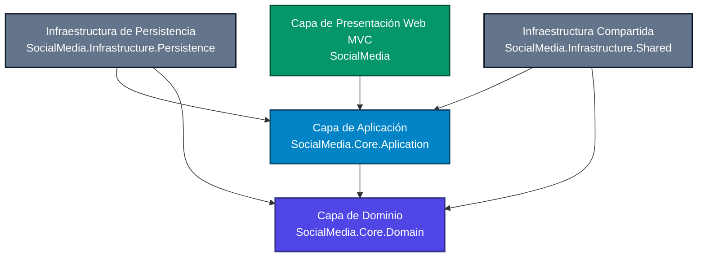

# 📱 RedSocial (SocialMedia) — ASP.NET Core Clean Architecture

[](https://dotnet.microsoft.com/download/dotnet/5.0)
[](https://www.microsoft.com/en-us/sql-server/)
[](https://learn.microsoft.com/en-us/dotnet/architecture/modern-web-apps-azure/common-web-application-architectures)
[](https://www.docker.com/)

Una plataforma interactiva de red social desarrollada con **ASP.NET Core 5.0 MVC** siguiendo estrictamente los principios de **Clean Architecture** (Arquitectura Cebolla). El proyecto incluye registro de usuarios con activación por correo electrónico, feed de publicaciones con imágenes, sistema de comentarios y gestión de amistades.

---

## 📐 Arquitectura del Proyecto

El sistema está estructurado en 5 capas desacopladas, lo que permite una alta mantenibilidad, escalabilidad y facilidad de pruebas. Las dependencias fluyen de afuera hacia adentro, protegiendo las reglas de negocio del dominio.



### 📂 Estructura de Carpetas

| Proyecto / Directorio | Capa | Responsabilidad |
| :--- | :--- | :--- |
| **`SocialMedia.Core.Domain`** | Dominio | Contiene las entidades puras del negocio (`Users`, `Publication`, `Comment`, `Friends`) y configuraciones comunes. No tiene dependencias externas. |
| **`SocialMedia.Core.Aplication`** | Aplicación | Define los casos de uso, DTOs, ViewModels, perfiles de `AutoMapper`, interfaces de repositorios/servicios y lógica de negocio. |
| **`SocialMedia.Infrastructure.Persistence`** | Persistencia | Implementa el acceso a datos mediante **Entity Framework Core**. Contiene el contexto (`ApplicationContext`), repositorios genéricos y específicos, y migraciones. |
| **`SocialMedia.Infrastructure.Shared`** | Compartido | Contiene servicios de soporte técnico ajenos a los datos principales, como el envío de correos mediante `MailKit` para la activación de cuentas. |
| **`SocialMedia`** | Presentación | Proyecto Web MVC de ASP.NET Core. Contiene la interfaz de usuario, controladores, vistas dinámicas (Razor), middlewares de sesión y recursos estáticos (`wwwroot`). |

---

## ✨ Características Principales

*   🔑 **Autenticación Completa**: Registro de nuevos usuarios, inicio de sesión seguro y cierre de sesión manejado mediante variables de sesión personalizadas y un middleware de validación activa (`ValidateUsers`).
*   📧 **Activación por Email**: Sistema que envía automáticamente un enlace único de verificación al correo electrónico del usuario registrado usando el protocolo SMTP (`MailKit`). El usuario no puede iniciar sesión hasta validar su cuenta.
*   📝 **Muro de Publicaciones**:
    *   Crear publicaciones con textos enriquecidos y fotos cargadas localmente (almacenadas en `wwwroot/Images`).
    *   Editar publicaciones existentes.
    *   Eliminar publicaciones con remoción automática de las imágenes asociadas en el disco.
*   💬 **Comentarios**: Los usuarios pueden interactuar añadiendo comentarios directamente en las publicaciones de otros miembros o de ellos mismos.
*   👥 **Módulo de Amigos**:
    *   Buscador inteligente de usuarios por su `Username`.
    *   Agregar y remover amigos con un solo clic.
    *   El feed principal filtra automáticamente para mostrar únicamente las publicaciones propias y de los amigos agregados.

---

## 🛠️ Tecnologías Utilizadas

*   **Backend**: C# 9.0 con ASP.NET Core 5.0
*   **Acceso a Datos**: Entity Framework Core 5.0 (soporta SQL Server e In-Memory Database para pruebas)
*   **Mapeo**: AutoMapper (para la conversión segura entre entidades y DTOs/ViewModels)
*   **Seguridad**: Middleware personalizado de autorización y encriptación de contraseñas.
*   **Mailing**: MailKit y MimeKit para envíos SMTP.
*   **Frontend**: Razor Views, HTML5, CSS3 y Bootstrap.
*   **Contenedores**: Docker y Docker Compose listos para despliegue rápido.

---

## 🚀 Instalación y Configuración

### Prerrequisitos

*   [.NET SDK 5.0](https://dotnet.microsoft.com/en-us/download/dotnet/5.0)
*   [SQL Server LocalDB / Express](https://www.microsoft.com/es-es/sql-server/sql-server-downloads) (o Docker)
*   Cuenta de correo SMTP activa (como Gmail con Contraseña de Aplicaciones) para el envío de correos.

### Pasos para Ejecutar Localmente

1.  **Clonar el repositorio**:
    ```bash
    git clone https://github.com/AlexanderPM11/socialMedia.git
    cd socialMedia
    ```

2.  **Configurar las credenciales en `appsettings.json`**:
    Abre [appsettings.json](file:///c:/Projects/Personal/Programacion/socialMedia/SocialMedia/appsettings.json) y actualiza la cadena de conexión de SQL Server y los parámetros de correo SMTP:

    ```json
    {
      "ConnectionStrings": {
        "DefaultConnection": "Server=TU_SERVIDOR_SQL;Database=RedSocial;Integrated Security=True;TrustServerCertificate=True"
      },
      "MailSettings": {
        "EmailFrom": "tu-email@gmail.com",
        "SmtpHost": "smtp.gmail.com",
        "SmtpPort": 587,
        "SmtpUser": "tu-email@gmail.com",
        "SmtpPass": "tu-contraseña-de-aplicacion-gmail",
        "DisplayName": "RedSocial"
      }
    }
    ```

    > [!TIP]
    > **Modo Base de Datos en Memoria**: Si quieres probar el proyecto de inmediato sin configurar SQL Server, puedes agregar la bandera `"UseInMemoryDatabase": true` en tu archivo de configuración o como variable de entorno.

3.  **Ejecutar la Aplicación**:
    Al arrancar la aplicación, esta aplicará automáticamente las migraciones pendientes en tu base de datos SQL Server (`dbContext.Database.MigrateAsync()`).

    ```bash
    dotnet run --project SocialMedia
    ```

4.  **Acceso al Navegador**:
    Abre tu navegador en [https://localhost:5001](https://localhost:5001) o [http://localhost:5000](http://localhost:5000).

---

## 🐳 Ejecución con Docker

El repositorio incluye soporte nativo para contenedores, lo que facilita el levantamiento de toda la infraestructura.

1.  **Construir y levantar contenedores**:
    ```bash
    docker-compose up --build
    ```
2.  La aplicación estará disponible a través de los puertos expuestos definidos en el archivo [docker-compose.yml](file:///c:/Projects/Personal/Programacion/socialMedia/docker-compose.yml).

---

## 🛸 Despliegue en Dokploy

Puedes desplegar este proyecto de manera muy sencilla en **Dokploy** utilizando la configuración multicontenedor ya preparada en [docker-compose.yml](file:///c:/Projects/Personal/Programacion/socialMedia/docker-compose.yml).

### Pasos para desplegar en Dokploy:

1. **Crear un Servicio Compose**:
   * En tu panel de Dokploy, ve a tu proyecto y selecciona **Create Service** > **Compose**.
2. **Configurar el Repositorio**:
   * Vincula tu repositorio de GitHub e indica la rama principal (`main` o `master`).
   * Especifica la ruta del archivo Compose: `docker-compose.yml`.
3. **Establecer las Variables de Entorno (Environment Variables)**:
   Agrega las siguientes variables en la sección de Variables de Entorno de Dokploy para mantener tus credenciales protegidas:
   
   | Variable | Descripción | Valor de Ejemplo |
   | :--- | :--- | :--- |
   | `MSSQL_PASSWORD` | Contraseña fuerte de Administrador de SQL Server | `MiClaveSegura2026!` |
   | `SMTP_EMAIL_FROM` | Correo remitente | `tu-correo@gmail.com` |
   | `SMTP_HOST` | Host del servidor SMTP | `smtp.gmail.com` |
   | `SMTP_PORT` | Puerto SMTP | `587` |
   | `SMTP_USER` | Usuario SMTP | `tu-correo@gmail.com` |
   | `SMTP_PASS` | Contraseña de aplicación del correo | `abcd efgh ijkl mnop` |
   | `SMTP_DISPLAY_NAME` | Nombre a mostrar en el remitente | `RedSocial Soporte` |

4. **Persistencia e Imágenes**:
   * El archivo de configuración ya tiene definidos los volúmenes `mssql_data` (para que la base de datos de SQL Server no se borre al actualizar) y `web_images` (para guardar las fotos de perfil e imágenes publicadas por los usuarios).
5. **Configurar Dominio / Puerto**:
   * En la configuración del servicio en Dokploy, expón el puerto **`8080`** (que redirige al puerto interno 80 de la aplicación) y asígnale el dominio o subdominio deseado. Dokploy configurará automáticamente el certificado SSL (HTTPS) mediante Traefik.

---

## 🛠️ Migraciones de Base de Datos

Si realizas cambios en las entidades del dominio (`SocialMedia.Core.Domain`) y deseas generar una nueva migración, ejecuta el siguiente comando desde la raíz del proyecto:

```bash
dotnet ef migrations add NombreDeTuMigracion --project SocialMedia.Infrastructure.Persistence --startup-project SocialMedia
```

Para aplicar manualmente las migraciones (aunque se aplican solas al arrancar):

```bash
dotnet ef database update --project SocialMedia.Infrastructure.Persistence --startup-project SocialMedia
```

---

## 📄 Licencia

Este proyecto es para fines educativos y personales. Siéntete libre de clonarlo, modificarlo o utilizarlo para tus propios desarrollos.
